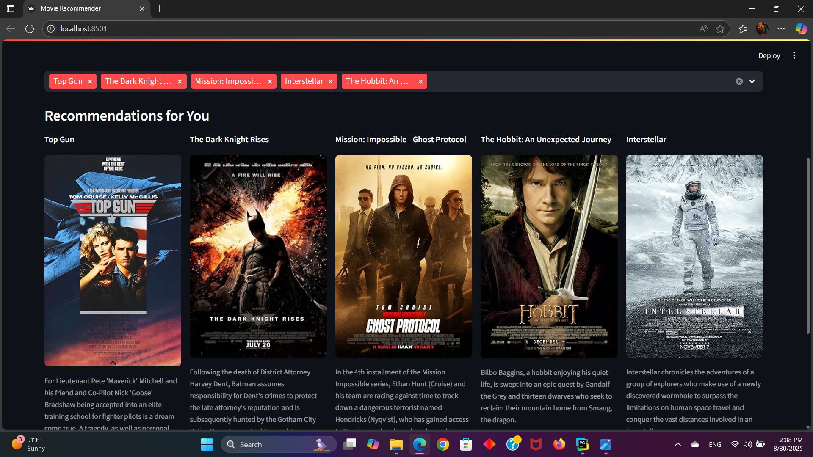

# 🎬 Movie Recommendation System

A **Movie Recommendation System** built with Python and deployed using **Streamlit**.  
This project leverages **machine learning techniques** to recommend movies based on Content-Based and Collaborative Filtering

---

## 🚀 Features

- Personalized **movie recommendations** based on Content-Based and Collaborative Filtering 
- Interactive **Streamlit UI** for user experience.  
- Search and filter movies easily.

---

## 📂 Project Structure

```
Movie-Recommendation-System
├── Dockerfile
├── Requirements.txt
├── License
├── src
│   ├── app
│   │   └── app.py
│   ├── notebooks
│   │   ├── Movie-Recommender.ipynb
│   │   ├── MovieEda.ipynb
│   │   ├── Credits.ipynb
│   │   └── KeywordsEda.ipynb
│   ├── models
│   │   ├── algo_mf.pkl
│   │   ├── algo_item_item.pkl
│   │   ├── index_item.pkl
│   │   ├── item_index.pkl
│   │   ├── train_seen.pkl
│   │   ├── uid_to_index.pkl
│   │   ├── user_cb_profiles.pkl
│   │   ├── X_items.pkl
│   │   ├── vectoriser.pkl
│   │   ├── movie_meta.csv
│   │   └── pop_candidates.csv
│   ├── data
│   │   ├── raw_data
│   │   │   ├── movies_metadata.csv
│   │   │   ├── credits.csv
│   │   │   ├── keywords.csv
│   │   │   ├── ratings_small.csv
│   │   │   ├── ratings.csv
│   │   │   ├── links.csv
│   │   │   └── links_small.csv
│   │   └── processed_data
│   │       ├── movies_metadata.csv
│   │       ├── credits.csv
│   │       ├── keywords.csv
│   │       ├── ratings_small.csv
│   │       └── links_small.csv
│   └── Report
│       └── report.pdf

```

---

## 🛠️ Installation & Setup

### 1. Clone the repository
```bash
git clone https://github.com/MohammadMahdiRazavi/Movie-Recommendation-System.git
cd Movie-Recommendation-System
```

### 2. Create a virtual environment (recommended)
```bash
python -m venv venv
source venv/bin/activate   # On Linux/Mac
venv\Scripts\activate      # On Windows
```

### 3. Install dependencies
```bash
pip install -r requirements.txt
```

---

## ▶️ Running Locally

Once everything is set up, start the Streamlit app:

```bash
streamlit run src/app/app.py
```

The app will launch in your browser at:  
👉 `http://localhost:8501`

---

## 📸 Screenshot

<p align="center">
  
</p>

---

## 📚 Tech Stack

- **Python**  
- **Pandas / NumPy**  
- **Scikit-learn** 
- **Scikit-surprise**
- **Streamlit**   

---


